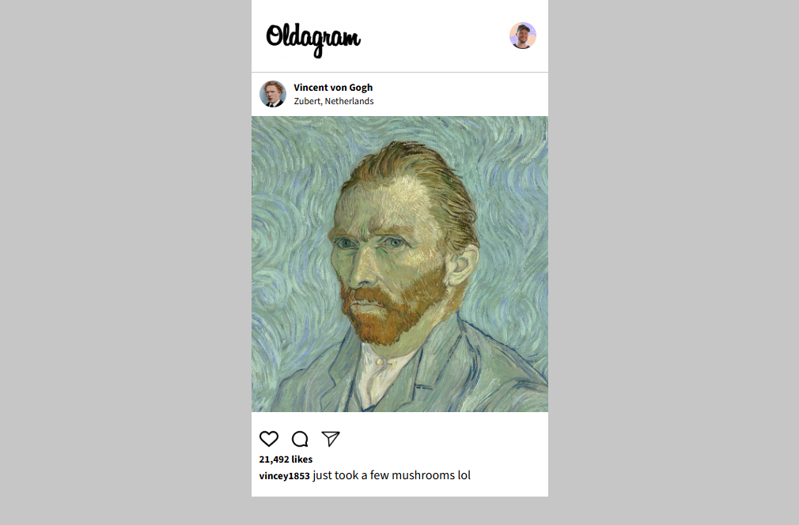

# Oldagram

A solo project built as part of the [Scrimba Frontend Developer Career Path](https://scrimba.com/).

Oldagram is a simple Instagram-style photo post.

---

## 🧩 Overview

It was built as a **solo project** to practice HTML, CSS, and JavaScript fundamentals — focusing on layout, styling, and basic interactivity.

---

## 🚀 Features

-   Display multiple posts with user info, images
-   Icons interaction
-   Like button interaction that updates the like count
-   Responsive layout for desktop and mobile
-   Simple, clean design

---

## 🛠️ Built With

-   **HTML5** – for the basic structure
-   **CSS3** – for layout and styling
-   **JavaScript**
    – for interactivity

---

## 📸 Preview

_(Add your screenshot here)_

```markdown

```

---

## 💡 What I Learned

-   How to dynamically update content with JavaScript
-   Structuring semantic HTML for reusable post cards
-   Using CSS for layout and responsive design

## 🕐 Time Spent

This first version was completed in about 2 hours.

## 🌱 Future Improvements

-   Add real user data fetched from a JSON file or API
-   Implement comments section
-   Improve responsive design and accessibility

## 📚 Acknowledgments

This project was built as part of the Scrimba Solo Projects.
